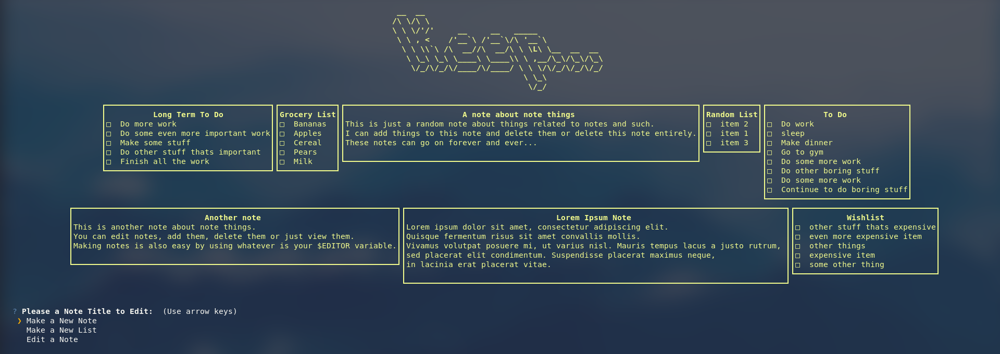

<h1 align="center">Keep-CLI</h1>

Keep-cli is a cli Google Keep client. You can add, delete, and manage your Google Keep notes.



## Setup

### Installation

#### PIP (easiest)
```sh
pip install keep-cli
```

#### Arch Linux (AUR)
```sh
yay -S keep-cli
```
#### macOS
```sh
brew cask install keep-cli
```

### Configuration
In order to make a note you must have the `$EDITOR` environment variable set to a text editor.

## Usage

### Run keep-cli visually:
#### Run the standard way:
```sh
keep-cli
```
#### Make a list or note:
For a note:
```sh
keep-cli --note
```
For a list:
```sh
keep-cli --list
```

## Features

## Other Resources
